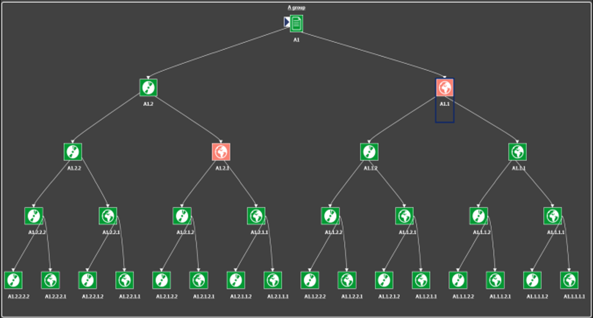
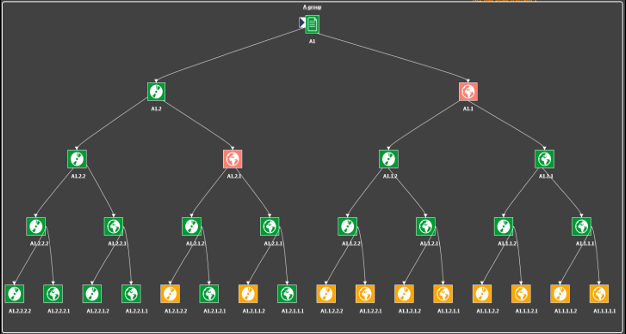
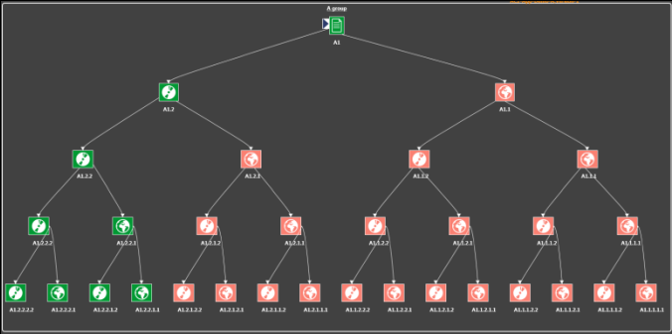
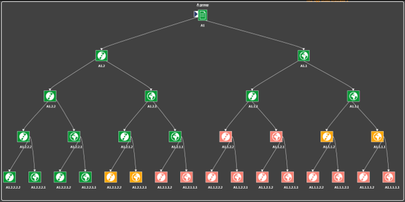
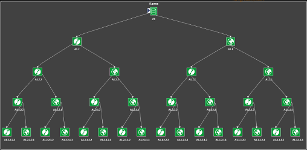

<h1 style="text-align: center;">AppControl Documentation</h1>

<figure style="display: flex; justify-content: center;">
    
</figure>

  AppControl reduces your applications downtimes by letting you react quickly to an ongoing incident.
   
   
  Supplementing your existing monitoring and supervision tools, AppControl acts on your applications to restart, repair, execute any custom actions, as you wish, on your information system.
   
   
  AppControl empowers your teams, increases their confidence level and lowers their stress during operations.

## Objectives

- Find root cause with no human intervention
- Eliminate human error when restarting
- Keep operational procedures tested and up-to-date

AppControl allows you to both monitor the status of applications in real time but **above all to act** when an incident occurs.
Where monitoring software signals you problems, AppControl offers to correct them.
 

  

## How it Works

In AppControl, an application is a hierarchy of components.   A component have several commands:

- A check command to retrieve the current state
- A start command
- A stop command
- And some optionals custom commands

- #### Dependencies behaviour
- A component can only starts if its parent's components are started.
- A component can only stops if its children's components are stopped.

#### Diagnostic

In this situation, there are 2 issues:

- 2 components are stopped whereas there parents are started

--> AppControl has detected the issues.

#### Resolution

1. AppControl stops orphans components

   

2. Healthy situation, we are ready to restore the services

   

3. Restart by branch

   

4. Normal situation

   

